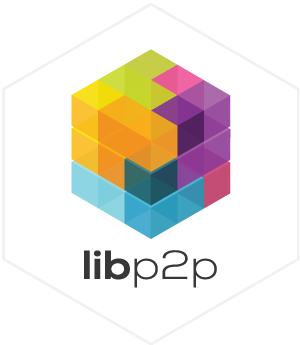

# De2do (de2do.xyz) — Local-First Peer-to-Peer Todos (Svelte)

[](https://github.com/NiKrause/simple-todo/actions)
[](https://github.com/NiKrause/simple-todo)
[](https://QmUdf5uJAunNqsos4USWGJDFRMpY6vUM1b24u2ky981Mtn.ipfs.dweb.link)
[](./LICENSE)

<div align="center" style="width: 100%;">
  <a href="https://libp2p.io/" target="_blank"></a>
  <a href="https://ipfs.tech/" target="_blank"></a>
  <a href="https://helia.io/" target="_blank"></a>
  <a href="https://orbitdb.org/" target="_blank"></a>
  <a href="https://filecoin.io/" target="_blank"></a>
  <a href="https://storacha.network/" target="_blank"></a>
</div>

A basic decentralized, local-first, peer-to-peer todo application built with `libp2p`, `IPFS`, and `OrbitDB`. This app demonstrates how modern Web3 technologies can create truly decentralized applications that work entirely in the browser.

See `docs/WEBAUTHN_VARSIG_CHANGES.md` for the WebAuthn varsig/PRF flow details and sequence diagrams.

**Passkey wallet + local Anvil / EntryPoint v0.8:** `docs/HOWTO_PASSKEY_ESCROW.md` · **Roadmap (E2E, env):** `docs/PLAN_LOCAL_AA_AND_E2E.md` · **One-shot local AA + contracts:** `pnpm run setup:local-aa` (with `anvil` running — see HOWTO §F)

> **Unstoppable** - This application demonstrates technology that continues operating even when cloud providers fail, governments attempt censorship, or software vendors shut down their services. Your data and functionality remain under your control, distributed across a resilient peer-to-peer network or self-hosted signaling or relay nodes. Imagine traditional software which was sold on a compact disc in the past - once installed it could never be stopped. A USP which should convince every client around the globe.

---

- **Progressive Web App**: If clouds are down, this is a PWA which can run from desktops and mobile devices connecting peer-to-peer to other collaborators via a relay or OrbitDB pinning network.
- **Storacha/Filecoin Integration with UCAN-Auth:** Backup & restore todo lists via Storacha gateway to Filecoin decentralized storage - restore the TodoList's OrbitDB decentralized form the IPFS network

## 🚀 Live Demo

- **HTTP**: https://de2do.xyz
- **HTTP (legacy host)**: https://simple-todo.le-space.de
- **IPFS (dweb.link)**: https://QmUdf5uJAunNqsos4USWGJDFRMpY6vUM1b24u2ky981Mtn.ipfs.dweb.link
- **IPFS (dweb.link, orbitdb demo)**: https://QmUdf5uJAunNqsos4USWGJDFRMpY6vUM1b24u2ky981Mtn.ipfs.dweb.link/#/orbitdb/zdpuAskw4Xes4nxR1YNV8TxK2qmrDgceAqEoGHDtTAUhQWvDP

### Key Features

- ✅ **Local-First Storage** - Data is stored in the browser only and is getting replicated to other peers via OrbitDB and IPFS
- ✅ **OrbitDB Relay-Pinning Nodes included** - If a peer is not online while data is needed by other peers - personal pinning nodes or full OrbitDB pinning networks can help out.
- ✅ **Peer-to-Peer Communication** - Browsers connect directly via WebRTC (with help of signaling nodes)
- ✅ **Real-time Synchronization** - Changes appear instantly across all peers
- ✅ **Encryption** - Todo-List is by default unencrypted and publicly stored on IPFS so it can be embedded easily into public websites. It is possible to encrypt your todo-list with a password.

This project uses the **`orbitdb-relay-pinner`** npm package for local/dev relay (see **`npm run relay`**). For ports, HTTP routes, and env vars, see **[Relay configuration](./docs/RELAY_CONFIG.md)** and **[Local relay / fork builds](./docs/LOCAL_RELAY.md)**.

### Quick Start

Run the simple-todo via a public relay

```bash
copy .env.example .env
npm install
npm run dev
```

Run a **local relay** (second terminal):

```bash
npm install
npm run relay
# or: npm run relay:verbose

# Copy a /ws/p2p/… or /webrtc-direct/… multiaddr from the relay logs (or curl http://127.0.0.1:3000/multiaddrs if HTTP_PORT=3000)
# into .env, e.g.:
# VITE_RELAY_BOOTSTRAP_ADDR_DEV=/ip4/127.0.0.1/tcp/4102/ws/p2p/<peerId>
```

There is **no `relay/` subfolder** in this repo; the relay CLI comes from **`node_modules/orbitdb-relay-pinner`**.

### Configuration

For detailed relay server configuration options and HTTP API endpoints, see **[Relay Configuration Documentation](./docs/RELAY_CONFIG.md)**.

## 🎯 How to Test

1. **Open Two Browser Windows** - You need at least two browser instances, a mobile device, or ask another distant person to open the app
2. **Load the Same URL** - all app users should load the same app URL
3. **Accept Consent** - Check all consent boxes in both browsers
4. **Wait for Connection** - The app will automatically discover and connect peers
5. **Copy URL from browser A to browser B** - If both browsers open the same todo-list they can see each other's todos (only A has write permission at the moment)
6. **Add Todos** - Create todos in one browser and watch them appear in the other

**Docs:** [Passkey + escrow (local Anvil)](./docs/HOWTO_PASSKEY_ESCROW.md) · [Testing / Playwright](./docs/TESTING.md) · [WebAuthn varsig notes](./docs/WEBAUTHN_VARSIG_CHANGES.md)

> A legacy `docs/TUTORIAL.md` / `tutorial-01.js` quick-start is **not** in this tree; use the HOWTO and `npm run dev` / `npm run test:e2e` instead.

## 📄 License

This project is open source and available under the [LICENSE](./LICENSE) file.

---
